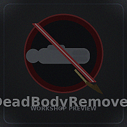

# Deadbody Auto Remover

Project Zomboid용 서버/월드 관리 모드입니다.
한 청크 안에 시체가 너무 많이 쌓이면 가장 오래된 시체부터 자동으로 제거합니다.

## 개요

이 모드는 시체가 과도하게 누적되는 상황을 자동으로 정리하기 위한 용도입니다.

- 청크 단위로 시체 수를 추적합니다.
- 설정한 최대치를 초과하면 가장 오래된 시체부터 제거합니다.
- 플레이어 시체는 옵션으로 포함 여부를 선택할 수 있습니다.
- Build 41 / Build 42 구조를 함께 포함하고 있습니다.

## 동작 방식

모드는 시체가 생성될 때 생성 시각과 고유 식별값을 기록합니다.
이후 각 청크의 시체 수를 관리하다가 제한을 넘으면 가장 오래된 시체를 우선 제거합니다.

이미 저장된 월드를 다시 불러와 시체들에 고유 식별값이 없는 경우에도 
청크를 로드하면서 기존 시체를 다시 인덱싱하고, 필요하면 즉시 정리합니다.

## 샌드박스 옵션

게임 내 샌드박스 옵션에서 아래 항목을 조정할 수 있습니다.

| 옵션 | 기본값 | 설명 |
| --- | --- | --- |
| Maximum corpses per chunk | `100` | 청크 내 시체 수가 이 값을 넘으면 자동 제거가 시작됩니다. |
| Maximum number of removals per events | `3` | 한 번의 처리에서 제거할 최대 시체 수입니다. |
| Remove player corpse | `false` | 플레이어 시체도 자동 제거 대상에 포함합니다. |
| Debug log output | `false` | 콘솔 로그에 디버그 메시지를 출력합니다. |

`Maximum corpses per chunk`를 `0`으로 두면 자동 제거가 사실상 비활성화됩니다.

## 포함 구조

저장소에는 아래 구조가 포함되어 있습니다.

- `Contents/mods/DeadbodyAutoRemover`: 기본 모드 파일
- `Contents/mods/DeadbodyAutoRemover/42`: Build 42용 모드 파일
- `workshop.txt`: Workshop 메타데이터
- `preview.png`: 미리보기 이미지

## English Summary

Deadbody Auto Remover automatically removes the oldest corpses in a chunk when the corpse count exceeds the configured limit.
It supports sandbox options for corpse limit, removal count per event, player corpse inclusion, and debug logging.
